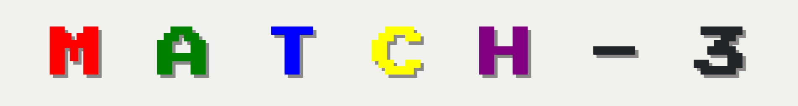

# Match-3 - Core mechanics only

Match-3 games are a genre of puzzle games where players must manipulate tiles or items on a grid with the goal of forming matches of 3 or more within the horizontal and/or vertical axes.

The core gameplay mechanics of a Match-3 game are:
1. Players swap adjacent tiles to form horizontal and/or vertical matches.
2. Matched tiles are cleared off the board allowing for more boards allowing new, random tiles to fall into the grid.
3. New tiles can form matches which are also cleared.
4. The goals of Match-3 games can vary between the different titles. 
    Specific Match-3 goals:
    - Clearing a specified number of tiles
    - Earning a specified number of points
    - Earning a specified number of points within a time limit or a turn limit
    Game Over conditions:
    - Running out of time before a specific number of tiles are cleared and/or a specific score is reached
    - Running out of turns before a specific number of tiles are cleared and/or a specific score is reached

[Link to Match-3 game](https://hansdksw.github.io/Match-3/)

## MVP
- Game board with size option for difficulty scaling. (Generates game boards of different sizes)
- Generates randomly placed tiles. 
- Select and swap selected tiles.
- Check for matches of 3 or more and remove matched tiles. If no matches are found, reduce move/turn count by 1 and return swapped tiles to their original positions. 
- Drops randomly generated tiles into the empty spaces.
- Include manual shuffle.
- Counts score up to a goal which triggers a `Victory` condition
- Counts moves/turns down from a set limit triggering a `Game Over` condition if the the count reaches `0`.

## User Stories
As a user, I want to:
1. See a starting page where I am able to select the size of the board and the number of different tiles.
2. See a grid with randomized tiles.
3. Click on two adjacent tiles and swap their positions. 
4. Clearly see the tiles I have selected.
5. See 3 or more matched tiles in rows and/or columns disappear while adding to my total points.
6. See random tiles to fall from the top of the grid to fill any empty spaces left behind by matched tiles.
7. See chain reactions caused by the falling tiles that create matches of 3 or more.
8. See my total points and points required for a victory condition.
9. See my remaining moves.
10. Be able to shuffle the board.
11. See a “Victory” screen if I clear the stage by reaching a specified point requirement.
12. See a “Game Over” screen if I run out of moves.
13. Be able to restart the game from the “Victory”, “Game Over” and game screens by clicking a restart button.
14. See tiles go back to their original positions if the swapped tiles do not result in 3 or more matching tiles.

## Lo-fi Wireframes
### Normal Game loop
**Normal gameplay loop:** Select board size > Select number of pieces > swap 2 tiles and check for a match 3 (or more) condition, clearing matched tiles > random tiles fall down from above to fill the space > chained matches cause more tiles to disappear > more random tiles fall from above to fill the space. > repeat until victory or game over condition is met.

Select Board Size

Select number of tiles

GAME START

Swap 2 tiles to match 3 - tiles disappear

Chain into a match 4 condition (top tiles move down into empty spaces)
)

Match 4 - tiles disappear

New tiles come in from above and fill empty spaces

### Victory Condition

### Game Over Condition

### Mismatch Condition
**Mismatch condition met:** tiles are swapped back to their original positions.
Mismatch

Return tiles to original positions

## Attributions
[NES CSS framework](https://nostalgic-css.github.io/NES.css/#)
[Press Start 2P](https://fonts.google.com/specimen/Press+Start+2P/license)

## Technologies Used
- HTML
- CSS
- JavaScript

## Stretch Goals
1. Randomize without getting more than 3 in rows or columns during initialization
2. Animation of swapping and swapping back if match fails
3. Manual hints - player initiated
4. Automatic shuffle when out of possible moves

## References
[References](./references.md)
